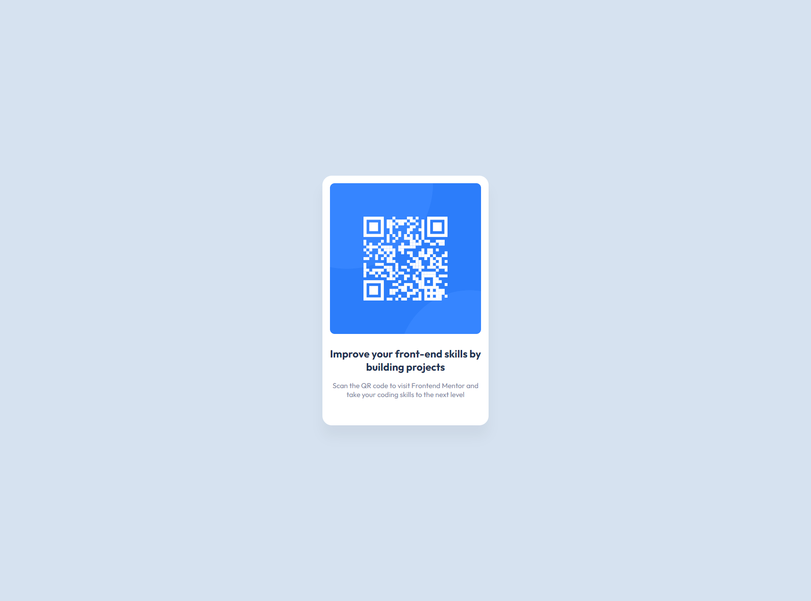

# Frontend Mentor - QR code component solution

## Table of contents

- [Overview](#overview)
  - [Screenshot](#screenshot)
  - [Links](#links)
  - [Built with](#built-with)

**Note: Delete this note and update the table of contents based on what sections you keep.**

## Overview

### Screenshot

### Links

- Live Site URL: [https://necxes.github.io/FEM_01-QR-Code/](https://necxes.github.io/FEM_01-QR-Code/)

### Built with

- Semantic HTML5 markup
- CSS custom properties
- Flexbox
- Mobile-first workflow
